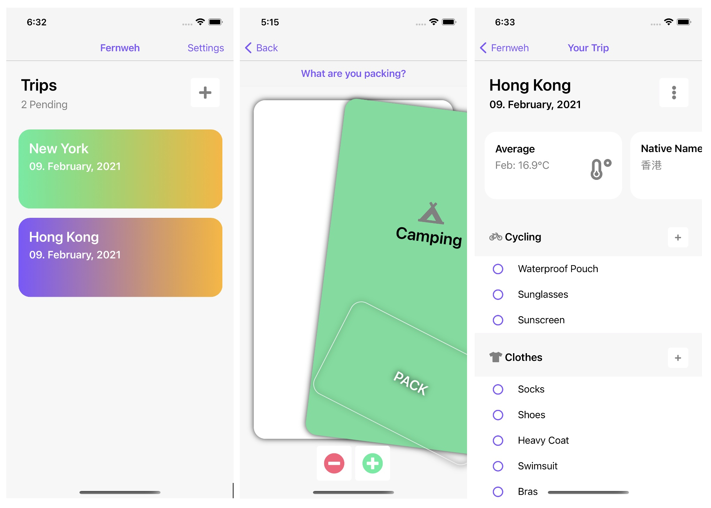

<br />

<p align="center">
  <a href="https://github.com/othneildrew/Best-README-Template">
    
  </a>
  <h3 align="center">Fernweh</h3>
  <p align="center">
    Never forget to pack anything again!
    <br />
    <a href="https://github.com/othneildrew/Best-README-Template">
  </p>

## About The Project

Fernweh is a packing list app and helps you to organise your packing list for your next vacation.




### Features

- Swipe trough categories to add from template
- Customise template
- Places Autocomplete
- Interesting facts about your destination

### Built With

This app is build with Xamarin, an open-source platform for building modern and performant applications for iOS and Android.
* [Xamarin](https://github.com/xamarin/Xamarin.Forms)

### Installation

1. Get a free API Key [https://developer.here.com](https://developer.here.com)
2. Clone the repo
   ```sh
   git clone https://github.com/fardage/Fernweh.git
   ```
3. Open Project with Visual Studio IDE
4. Enter your API in `Credentials.cs`
   ```c#
   public const string ApiKeyHereMaps = "ENTER YOUR API";
   ```

## License

Distributed under the MIT License. See `LICENSE` for more information.

## Acknowledgements
* [Font Awesome](https://fontawesome.com)
* [Xamarin.Forms.PancakeView](https://github.com/sthewissen/Xamarin.Forms.PancakeView)
* [SwipeCardView](https://github.com/markolazic88/SwipeCardView)
* [Undraw](https://undraw.co)
* [Monkey Cache](https://github.com/jamesmontemagno/monkey-cache)
